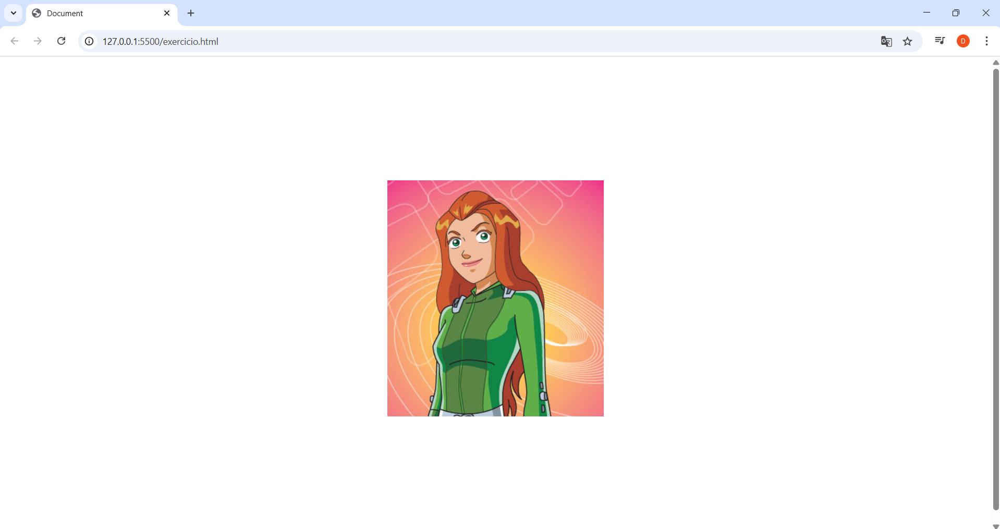

# FlexBox
O **Flexbox**, ou **Flexible Box Layout**, é um módulo de layout unidimensional do CSS que ajuda a organizar itens em uma linha ou coluna. É ideal para criar interfaces de usuário dinâmicas e responsivas, distribuindo o espaço entre os itens de forma eficiente.

### Conceitos Principais

* **Contêiner Flex (Flex Container):** É o elemento pai que contém todos os itens. Para ativá-lo, você precisa definir a propriedade `display: flex`.
* **Item Flex (Flex Item):** São os elementos filhos diretos dentro do contêiner.

---

### Propriedades do Contêiner Flex

* `display: flex`: Transforma o elemento em um contêiner flex.
* `flex-direction`: Define a direção do eixo principal. Pode ser `row` (padrão, da esquerda para a direita), `row-reverse`, `column` (de cima para baixo) ou `column-reverse`.
* `justify-content`: Alinha os itens ao longo do eixo principal. Exemplos: `flex-start`, `flex-end`, `center`, `space-between` e `space-around`.
* `align-items`: Alinha os itens ao longo do eixo transversal (o eixo perpendicular ao principal). Exemplos: `flex-start`, `flex-end`, `center`, `stretch` e `baseline`.
* `flex-wrap`: Controla se os itens devem quebrar a linha. Valores possíveis: `nowrap` (padrão), `wrap` ou `wrap-reverse`.

---

### Propriedades dos Itens Flex

* `flex-grow`: Define a capacidade de um item crescer para ocupar o espaço disponível. O valor é um número.
* `flex-shrink`: Define a capacidade de um item encolher se não houver espaço suficiente. O valor é um número.
* `flex-basis`: Define o tamanho inicial de um item antes de o espaço restante ser distribuído. Pode ser um valor em pixels, porcentagem, etc., ou `auto`.
* `order`: Define a ordem visual de um item dentro do contêiner. O valor é um número (padrão é 0). Itens com valores menores aparecem primeiro.
* `align-self`: Sobrescreve a propriedade `align-items` para um item flex individual.

### Por que Usar Flexbox?

O Flexbox simplifica o processo de alinhamento e distribuição de espaço, tornando-o muito mais fácil do que os métodos tradicionais (como `float` ou `position`). Ele é ideal para layouts mais simples, como barras de navegação, galerias de imagens ou componentes de interface.

Para layouts bidimensionais mais complexos (tanto em linha quanto em coluna), o **CSS Grid Layout** costuma ser uma opção mais poderosa.

### Exercicios

### 1. Centralizando um elemento
Crie uma `
` (o contêiner) e, dentro dela, outra `
` (o item). Seu objetivo é centralizar o item, tanto vertical quanto horizontalmente, dentro do contêiner.

**Dica:** Você vai precisar de uma combinação das propriedades `justify-content` e `align-items` no contêiner.

### 2. Barra de navegação responsiva
Crie uma barra de navegação simples usando uma `<nav>` (o contêiner) com uma lista `<ul>` (o contêiner flex) e vários `<li>` (os itens) com links. O objetivo é que os itens se distribuam uniformemente pelo espaço disponível.

**Desafio:** Se a tela for pequena, faça com que a barra de navegação quebre a linha, colocando os itens um abaixo do outro.

**Dica:** Use `justify-content: space-around` para distribuir os itens. Para o desafio, a propriedade `flex-wrap` será sua melhor amiga.

### 3. Galeria de fotos
Crie um contêiner para uma galeria de fotos. Dentro dele, coloque várias `
` com imagens. O objetivo é que as fotos se ajustem automaticamente na tela, preenchendo o espaço disponível, e quebrem para a próxima linha quando necessário.

**Dica:** Combine `flex-wrap` para quebrar a linha e `flex-grow` ou `flex-basis` para controlar como as fotos se comportam em diferentes tamanhos de tela. Experimente diferentes valores para ver o resultado.